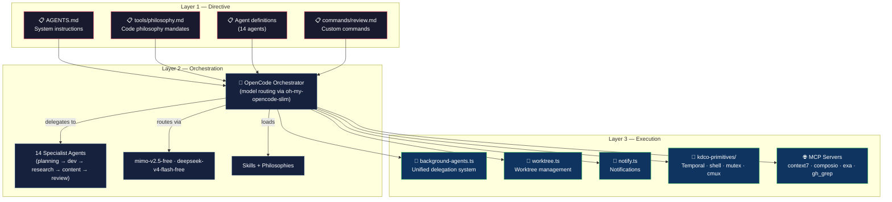

# 🤖 my-agent-harness

**Personal AI orchestration — 14 agents, 7+ plugins, 4 MCP servers, and a self-annealing philosophy.**

A personalized AI agent orchestration setup built on [`@opencode-ai/plugin`](https://opencode.ai) (v1.18.4). This is my development harness — a complete agent ecosystem for planning, coding, researching, reviewing, and shipping software with AI that follows real engineering discipline.

---

## 📋 Table of Contents

- [Architecture](#-architecture)
- [Agent Roster](#-agent-roster)
- [Plugins](#-plugins)
- [Skills](#-skills)
- [Model Routing](#-model-routing)
- [MCP Servers](#-mcp-servers)
- [Quick Start](#-quick-start)
- [Configuration](#-configuration)
- [Project Structure](#-project-structure)
- [Built With](#-built-with)
- [License](#-license)

---

## 🏗 Architecture

The harness operates on a **3-layer separation of concerns** that maximizes reliability by keeping probabilistic LLM decisions away from deterministic business logic.



**How it works:**

1. **Directives** define *what* to do — natural language SOPs in Markdown that set goals, inputs, and expected outputs.
2. **Orchestration** (the AI layer) reads directives, selects the right agent, loads the required philosophy, and coordinates execution. It's the intelligent router.
3. **Execution** is handled by deterministic TypeScript plugins and MCP tools — the reliable, testable foundation that doesn't hallucinate.

When something breaks, the system **self-anneals**: it reads the error, fixes the plugin, tests it, and updates the directive so the same mistake never happens twice.

---

## 👥 Agent Roster

14 specialist agents organized into 6 functional categories:

### Planning

| Agent | Description |
|-------|-------------|
| **adr-manager** | Creates and maintains Architecture Decision Records (ADRs) — lightweight docs capturing important architectural decisions with context and consequences. |
| **architecture-analyzer** | Domain-Driven Design specialist — bounded contexts, aggregates, domain events, context mapping, and strategic design artifacts. |
| **contract-manager** | API contract-first design — OpenAPI 3.0+ specs, consumer-driven contracts, request/response schemas, and API governance. |
| **plan** | Strategic planning orchestrator. Breaks requirements into tasks, delegates execution to specialist agents, tracks results, and adapts. |
| **story-mapper** | User story mapping — identifies personas, maps user journeys, identifies vertical slices, and decomposes work into epics and stories. |
| **system-builder** | Generates complete `.opencode` folder architectures from project requirements — discovers project structure, interviews for gaps, and scaffolds. |

### Development

| Agent | Description |
|-------|-------------|
| **coder** | Technical implementation specialist for writing and modifying code. Follows code philosophy mandates before every implementation. |
| **devops-specialist** | CI/CD pipelines, Docker, Kubernetes, Terraform, infrastructure-as-code, deployment automation, and cloud architecture. |
| **test-engineer** | Test strategy and authoring — unit, integration, and e2e tests (Jest, Vitest, pytest, Playwright, Cypress). TDD and coverage analysis. |

### Research

| Agent | Description |
|-------|-------------|
| **explore** | Codebase exploration specialist — analyzes project structure, traces code paths, returns compressed context for other agents. |
| **researcher** | External knowledge architect — gathers implementation-ready research with full citations and reusable code snippets. |

### Content

| Agent | Description |
|-------|-------------|
| **scribe** | Human-facing content specialist — documentation, commit messages, PR descriptions, changelogs, and release notes. |

### Review

| Agent | Description |
|-------|-------------|
| **reviewer** | Expert code reviewer applying 4 Review Layers (Correctness, Security, Performance, Style) with confidence-gated findings. Loads `code-review` skill and relevant philosophy for every review. |

### Orchestration

| Agent | Description |
|-------|-------------|
| **build** | Build orchestrator that coordinates implementation through delegation. Parses requests, dispatches to specialist agents, monitors progress, and reports results. |

---

## 🔌 Plugins

### TypeScript Plugins

| Plugin | Description |
|--------|-------------|
| **background-agents** | Unified, async-first delegation system. Replaces native `task` tool with persistent agent outputs stored to disk — orchestrator receives only references. Based on [oh-my-opencode](https://github.com/code-yeongyu/oh-my-opencode). |
| **worktree** | Worktree management — creates, switches, and manages Git worktrees for parallel development streams. |
| **notify** | Desktop and terminal notifications for agent events — status updates, completion alerts, and multiplexer-aware routing. |
| **kdco-primitives** | Primitive utility library — timeouts, mutexes, shell execution, terminal detection, temporary file management, CMUX multiplexer integration, and logging. |
| **workspace-plugin** | Workspace configuration and management. |

### Loaded via opencode.jsonc

| Plugin | Version / Ref |
|--------|---------------|
| `@tarquinen/opencode-dcp` | v3.1.3 — Dynamic Context Pruning |
| `@franlol/opencode-md-table-formatter` | v0.0.6 — Markdown table formatting |
| `oh-my-opencode-slim` | latest — Skill registry + model routing |
| `envsitter-guard` | — Environment variable guardrails |
| `@spoons-and-mirrors/pocket-universe` | latest — Knowledge base integration |
| `opencode-plugin-openspec` | — OpenSpec specification support |
| `opencode-review` | — Review workflow automation |
| `@dietrichgebert/ponytail` | — Ponytail mode (lazy dev philosophy) |

---

## 🛠 Skills

### Managed Skills (oh-my-opencode-slim v2.2.8)

| Skill | Status | Description |
|-------|--------|-------------|
| **simplify** | ✅ managed | Simplifies complex code patterns |
| **codemap** | ✅ managed | Codebase mapping and visualization |
| **clonedeps** | ✅ managed | Clone dependency management |
| **deepwork** | ✅ managed | Deep focus / extended context workflows |
| **verification-planning** | ✅ managed | Verification-driven development planning |
| **reflect** | ✅ managed | Post-session reflection and learning |
| **oh-my-opencode-slim** | ✅ managed | Self-managing skill registry |
| **worktrees** | ✅ managed | Git worktree automation workflows |

### gstack Skills

A full suite of workflow skills prefixed with `gstack-` for structured development operations: `gstack-design-review`, `gstack-design-html`, `gstack-design-consultation`, `gstack-design-shotgun`, `gstack-browse`, `gstack-qa`, `gstack-ship`, `gstack-land-and-deploy`, `gstack-review`, `gstack-investigate`, `gstack-retro`, `gstack-office-hours`, `gstack-plan-ceo-review`, `gstack-plan-eng-review`, `gstack-plan-design-review`, `gstack-setup-browser-cookies`, `gstack-setup-deploy`, `gstack-setup-gbrain`, `gstack-upgrade`, and more.

### mp-* Skills

Community-curated skills: `mp-implement`, `mp-research`, `mp-tdd`, `mp-code-review`, `mp-codebase-design`, `mp-diagnosing-bugs`, `mp-domain-modeling`, `mp-wayfinder`, `mp-handoff`, `mp-teach`, `mp-grill-me`, `mp-resolving-merge-conflicts`, `mp-edit-article`, `mp-obsidian-vault`, `mp-prototype`, `mp-scaffold-exercises`, `mp-triage`, `mp-to-spec`, `mp-to-tickets`, `mp-writing-great-skills`, and more.

---

## 🧠 Model Routing

The `oh-my-opencode-slim.json` preset configures 6 specialized model roles with tiered capability:

| Role | Model | Variant | Capabilities |
|------|-------|---------|--------------|
| **Orchestrator** | `mimo-v2.5-free` | high | All skills · All MCPs — full executive agent |
| **Oracle** | `deepseek-v4-flash-free` | high | `simplify` + `code-review` — deep analytical work |
| **Librarian** | `deepseek-v4-flash-free` | medium | Web search · context7 · gh_grep — information retrieval |
| **Explorer** | `deepseek-v4-flash-free` | low | Lightweight exploration tasks |
| **Designer** | `deepseek-v4-flash-free` | medium | UI/UX design and review workflows |
| **Fixer** | `deepseek-v4-flash-free` | high | Targeted bug fixing and patching |

The **tmux multiplexer** runs with a `main-vertical` layout at 60% main pane size, enabling parallel agent workflows side-by-side.

---

## 🌐 MCP Servers

| Server | URL | Purpose |
|--------|-----|---------|
| **context7** | `mcp.context7.com` | Library/framework documentation retrieval |
| **composio** | `connect.composio.dev` | Integration platform connectivity |
| **exa** | `mcp.exa.ai` | Web search and content discovery |
| **gh_grep** | `mcp.grep.app` | GitHub code search and pattern matching |

---

## 🚀 Quick Start

### Prerequisites

- [OpenCode](https://opencode.ai) CLI installed
- Node.js 18+
- (Optional) tmux for multiplexer support

### Installation

```bash
# Clone the harness
git clone https://github.com/your-username/my-agent-harness.git
cd my-agent-harness

# Install plugin dependencies
npm install

# Link to OpenCode config
# On macOS/Linux:
ln -s "$(pwd)" ~/.config/opencode

# On Windows (PowerShell):
# New-Item -ItemType Junction -Path "$env:USERPROFILE\.config\opencode" -Target "$(pwd)"
```

### Verify It Works

```bash
# List available agents
opencode agent list

# Run a review command
opencode run review

# Check skill registry
opencode skill list
```

---

## ⚙️ Configuration

### Core Files

| File | Purpose |
|------|---------|
| `opencode.jsonc` | Main configuration — plugins, MCP servers, permission model, agent overrides, code philosophy instructions |
| `oh-my-opencode-slim.json` | Model routing presets, multiplexer config, agent orchestrator prompts, disabled agents |
| `ocx.jsonc` | OCX registry pointing to `registry.kdco.dev` for skill discovery |
| `dcp.jsonc` | Dynamic Context Pruning schema config |
| `package.json` | Plugin dependencies (`@opencode-ai/plugin` v1.18.4, zod, node-notifier, etc.) |

### Profiles

The `profiles/default/` directory contains environment-specific overrides for `opencode.jsonc` and `ocx.jsonc`.

### Permission Model

The harness uses a **deny-by-default** permission model with per-agent overrides:

- **Top-level denies**: `context7_*`, `exa_*`, `gh_grep_*`, `kagi_*`, `webfetch`, `worktree_*` — agents must be explicitly allowed
- **plan agent** (mode: `primary`): Edit/write/bash denied, delegation read/list allowed, worktree management allowed — purpose-built as a read-only orchestrator
- **scribe agent**: Bash denied, edit/write/read/glob allowed — content creation without shell access

---

## 📁 Project Structure

```
.config/opencode/
├── agents/                    # 14 specialist agent definitions
│   ├── planning/              #   adr-manager, architecture-analyzer, contract-manager, plan, story-mapper, system-builder
│   ├── development/           #   coder, devops-specialist, test-engineer
│   ├── research/              #   explore, researcher
│   ├── content/               #   scribe
│   ├── review/                #   reviewer
│   └── orchestration/         #   build
├── plugins/                   # TypeScript plugins
│   ├── background-agents.ts   #   Unified delegation system
│   ├── worktree.ts            #   Git worktree management
│   ├── notify.ts              #   Notification dispatch
│   ├── workspace-plugin.ts    #   Workspace management
│   └── kdco-primitives/       #   Utility primitives (mutex, shell, timeout, etc.)
├── skills/                    # Skill definitions + version manifest (v1.60.1.0)
│   ├── gstack-*/              #   Structured development workflow skills
│   ├── mp-*/                  #   Community skills
│   ├── extension/             #   Browser extension (sidepanel, popup, inspector)
│   └── docs/                  #   Tutorials and design docs
├── tools/
│   └── philosophy.md          # Code philosophy loading mandates
├── profiles/default/          # Environment-specific config overrides
├── commands/
│   └── review.md              # Custom `opencode run review` command
├── .oh-my-opencode-slim/      # Managed skill registry (8 skills)
├── .ocx/                      # OCX registry cache
├── .gstack/                   # Browse audit log
├── .ponytail-active           # Ponytail mode marker
├── opencode.jsonc             # Main configuration
├── oh-my-opencode-slim.json   # Model routing + presets
├── ocx.jsonc                  # KDCO registry config
├── dcp.jsonc                  # Dynamic Context Pruning config
└── package.json               # Plugin dependencies
```

---

## 📖 Philosophy

This harness is governed by two code philosophy mandates that every agent must load before implementation:

- **`frontend-philosophy`** — The 5 Pillars of Intentional UI (for UI/frontend work)
- **`code-philosophy`** — The 5 Laws of Elegant Defense (for backend/logic work)

These are non-negotiable. The `tools/philosophy.md` directive enforces that agents select, load, and verify against the relevant philosophy before writing a single line of code.

---

## 🧩 Built With

- **[OpenCode](https://opencode.ai)** — AI-native development platform
- **[`@opencode-ai/plugin`](https://www.npmjs.com/package/@opencode-ai/plugin)** v1.18.4 — Plugin SDK
- **[oh-my-opencode-slim](https://github.com/code-yeongyu/oh-my-opencode-slim)** — Skill registry and model routing
- **[oh-my-opencode](https://github.com/code-yeongyu/oh-my-opencode)** — Background agent delegation system (MIT)
- **[Context7](https://context7.com)** — Documentation MCP server
- **[Exa](https://exa.ai)** — Web search MCP server
- **[grep.app](https://grep.app)** — GitHub code search MCP server
- **[Composio](https://composio.dev)** — Integration platform
- **[KDCO Registry](https://registry.kdco.dev)** — Skill package registry
- **[Ponytail](https://github.com/dietrichgebert/ponytail)** — Lazy development philosophy plugin
- **[unique-names-generator](https://github.com/andreasonny83/unique-names-generator)** — Agent naming
- **[zod](https://zod.dev)** — Schema validation
- **[node-notifier](https://github.com/mikaelbr/node-notifier)** — Desktop notifications

---

## 📄 License

MIT © 2026

Permission is hereby granted, free of charge, to any person obtaining a copy of this software and associated documentation files (the "Software"), to deal in the Software without restriction, including without limitation the rights to use, copy, modify, merge, publish, distribute, sublicense, and/or sell copies of the Software, and to permit persons to whom the Software is furnished to do so, subject to the following conditions:

The above copyright notice and this permission notice shall be included in all copies or substantial portions of the Software.

THE SOFTWARE IS PROVIDED "AS IS", WITHOUT WARRANTY OF ANY KIND, EXPRESS OR IMPLIED, INCLUDING BUT NOT LIMITED TO THE WARRANTIES OF MERCHANTABILITY, FITNESS FOR A PARTICULAR PURPOSE AND NONINFRINGEMENT. IN NO EVENT SHALL THE AUTHORS OR COPYRIGHT HOLDERS BE LIABLE FOR ANY CLAIM, DAMAGES OR OTHER LIABILITY, WHETHER IN AN ACTION OF CONTRACT, TORT OR OTHERWISE, ARISING FROM, OUT OF OR IN CONNECTION WITH THE SOFTWARE OR THE USE OR OTHER DEALINGS IN THE SOFTWARE.

---

<p align="center">
  <sub>Built with 🧠 by an agent harness that reviews its own code.</sub>
</p>
