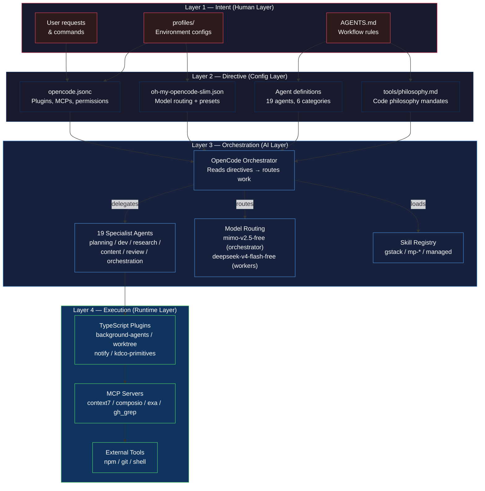
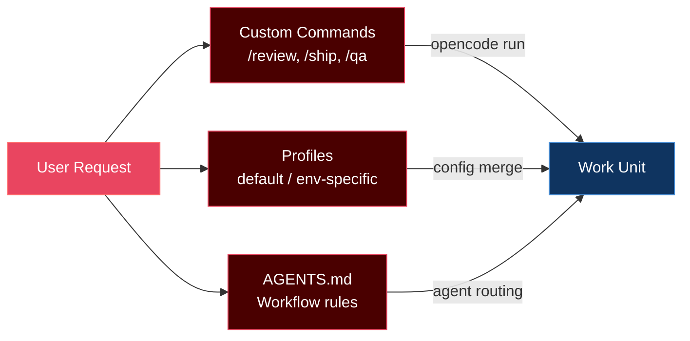
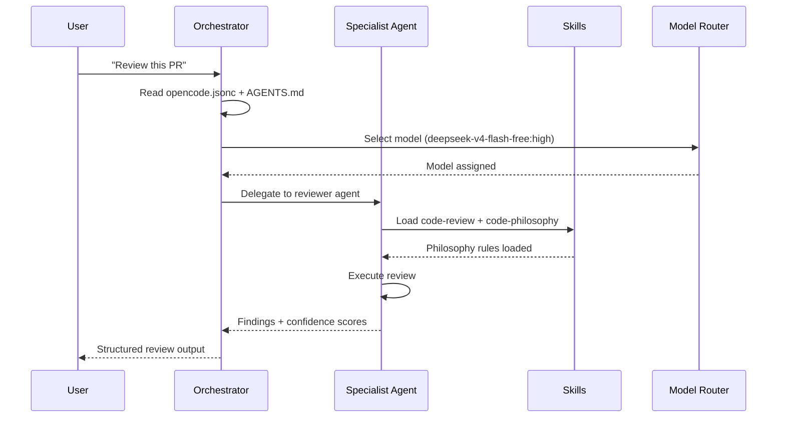
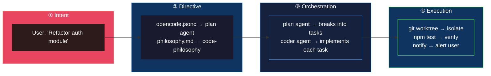

# my-agent-harness

**Personal AI orchestration — 24 agents, 32 runtime scripts, 7+ plugins, 4 MCP servers, and a self-annealing philosophy.**

A personalized AI agent orchestration setup built on [`@opencode-ai/plugin`](https://opencode.ai) (v1.18.4). This is my development harness — a complete agent ecosystem for planning, coding, researching, reviewing, and shipping software with AI that follows real engineering discipline.

## ▸ Table of Contents

- [Architecture](#architecture)
- [Agent Roster](#agent-roster)
- [Plugins](#plugins)
- [Skills](#skills)
- [Model Routing](#model-routing)
- [MCP Servers](#mcp-servers)
- [Quick Start](#quick-start)
- [Configuration](#configuration)
- [Project Structure](#project-structure)
- [Built With](#built-with)
- [License](#license)

## ▸ Architecture

The harness operates on a **4-layer architecture** that separates concerns from human intent through to deterministic execution, keeping probabilistic LLM decisions safely away from business logic.



### Layer-by-Layer Breakdown

#### Layer 1 → Intent (Human Layer)

Where work begins. User requests, profile configurations, and workflow rules (`AGENTS.md`) define *what* needs to happen — no technical implementation details.



#### Layer 2 → Directive (Config Layer)

Translates intent into machine-readable directives. Every file here is a *constraint* the orchestrator must follow.

| Directive File | What It Controls |
|----------------|------------------|
| `opencode.jsonc` | Plugins, MCP servers, permission model (deny-by-default) |
| `oh-my-opencode-slim.json` | Model routing (6 roles × 3 tiers), multiplexer layout |
| Agent `.md` files | Per-agent capabilities, tool access, philosophy loading |
| `tools/philosophy.md` | Non-negotiable code philosophy mandates for implementation |

#### Layer 3 → Orchestration (AI Layer)

The probabilistic core. The orchestrator reads directives, selects the right agent and model, loads skills, and delegates work.



#### Layer 4 → Execution (Runtime Layer)

Deterministic. No LLM calls — just TypeScript plugins, MCP tool calls, shell commands, and 32 runtime scripts carrying out the orchestrated work.

```mermaid
graph TD
    subgraph Plugins["TypeScript Plugins"]
        BG["background-agents<br/>Async delegation"]
        WT["worktree<br/>Git worktrees"]
        NT["notify<br/>Desktop alerts"]
        KD["kdco-primitives<br/>Mutex / Shell / Timeout"]
    end

    subgraph MCP["MCP Servers"]
        C7["context7<br/>Library docs"]
        CX["composio<br/>Integrations"]
        EX["exa<br/>Web search"]
        GH["gh_grep<br/>GitHub code search"]
    end

    subgraph Scripts["Runtime Scripts (32)"]
        R1["R1 Core<br/>flock, state, correlation, log, workflow-init"]
        R2["R2 Execution<br/>dispatch, task-board, dag-execute, checkpoint, recover"]
        R3["R3 Isolation<br/>worktree, merge, merge-conflict, cleanup"]
        R4["R4 Cost<br/>budget, budget-enforce, cache, cost, cost-report"]
        R5["R5 Observability<br/>replay, trace, health, dashboard"]
        R6["R6 Quality<br/>quality-gate, evaluate, convention, auto-dream, load-context"]
        R7["R7 Safety<br/>stale-task, dry-run, workflow-complete, hooks"]
    end

    subgraph Ext["External Tools"]
        GIT["git"]
        NPM["npm / node"]
        SH["shell"]
    end

    BG --> WT
    BG --> NT
    KD --> BG

    C7 -->|"API calls"| Ext
    CX -->|"API calls"| Ext
    EX -->|"web fetch"| Ext
    GH -->|"code search"| Ext

    R1 --> R2
    R2 --> R3
    R3 --> R4
    R4 --> R5
    R5 --> R6
    R6 --> R7

    style Plugins fill:#0f3460,stroke:#53d769,color:#fff
    style MCP fill:#0f3460,stroke:#4a90d9,color:#fff
    style Scripts fill:#16213e,stroke:#e94560,color:#fff
    style Ext fill:#1a1a2e,stroke:#888,color:#fff
    style BG fill:#0f3460,stroke:#53d769,color:#fff
    style WT fill:#0f3460,stroke:#53d769,color:#fff
    style NT fill:#0f3460,stroke:#53d769,color:#fff
    style KD fill:#0f3460,stroke:#53d769,color:#fff
    style C7 fill:#0f3460,stroke:#4a90d9,color:#fff
    style CX fill:#0f3460,stroke:#4a90d9,color:#fff
    style EX fill:#0f3460,stroke:#4a90d9,color:#fff
    style GH fill:#0f3460,stroke:#4a90d9,color:#fff
    style R1 fill:#16213e,stroke:#e94560,color:#fff
    style R2 fill:#16213e,stroke:#e94560,color:#fff
    style R3 fill:#16213e,stroke:#e94560,color:#fff
    style R4 fill:#16213e,stroke:#e94560,color:#fff
    style R5 fill:#16213e,stroke:#e94560,color:#fff
    style R6 fill:#16213e,stroke:#e94560,color:#fff
    style R7 fill:#16213e,stroke:#e94560,color:#fff
    style GIT fill:#1a1a2e,stroke:#888,color:#fff
    style NPM fill:#1a1a2e,stroke:#888,color:#fff
    style SH fill:#1a1a2e,stroke:#888,color:#fff
```



### Request Flow (End-to-End)

How a single user request traverses all 4 layers:



**Key principle:** LLMs (Layer 3) never directly execute business logic. They route and plan — Layer 4 carries out the actual work deterministically.

## ▸ Agent Roster

19 specialist agents organized into 6 functional categories:

### Planning

| Agent | Description |
|-------|-------------|
| **adr-manager** | Creates and maintains Architecture Decision Records (ADRs) — lightweight docs capturing important architectural decisions with context and consequences. |
| **architecture-analyzer** | Domain-Driven Design specialist — bounded contexts, aggregates, domain events, context mapping, and strategic design artifacts. |
| **contract-manager** | API contract-first design — OpenAPI 3.0+ specs, consumer-driven contracts, request/response schemas, and API governance. |
| **plan** | Strategic planning orchestrator. Breaks requirements into tasks, delegates execution to specialist agents, tracks results, and adapts. |
| **story-mapper** | User story mapping — identifies personas, maps user journeys, identifies vertical slices, and decomposes work into epics and stories. |
| **system-builder** | Generates complete `.opencode` folder architectures from project requirements — discovers project structure, interviews for gaps, and scaffolds. |

### Development

| Agent | Description |
|-------|-------------|
| **coder** | Technical implementation specialist for writing and modifying code. Follows code philosophy mandates before every implementation. |
| **typescript-pro** | TypeScript specialist — type-safe code, generics, utility types, and TS ecosystem patterns. |
| **refactoring-specialist** | Code refactoring expert — improves code structure, eliminates smells, and applies design patterns safely. |
| **mcp-developer** | MCP protocol specialist — builds servers/clients, configures integrations, and debugs MCP connections. |
| **devops-specialist** | CI/CD pipelines, Docker, Kubernetes, Terraform, infrastructure-as-code, deployment automation, and cloud architecture. |
| **test-engineer** | Test strategy and authoring — unit, integration, and e2e tests (Jest, Vitest, pytest, Playwright, Cypress). TDD and coverage analysis. |

### Research

| Agent | Description |
|-------|-------------|
| **explore** | Codebase exploration specialist — analyzes project structure, traces code paths, returns compressed context for other agents. |
| **researcher** | External knowledge architect — gathers implementation-ready research with full citations and reusable code snippets. |

### Content

| Agent | Description |
|-------|-------------|
| **scribe** | Human-facing content specialist — documentation, commit messages, PR descriptions, changelogs, and release notes. |

### Review

| Agent | Description |
|-------|-------------|
| **reviewer** | Expert code reviewer applying 4 Review Layers (Correctness, Security, Performance, Style) with confidence-gated findings. Loads `code-review` skill and relevant philosophy for every review. |

### Orchestration

| Agent | Description |
|-------|-------------|
| **build** | Build orchestrator that coordinates implementation through delegation. Parses requests, dispatches to specialist agents, monitors progress, and reports results. Uses 14 runtime scripts for DAG execution, semantic caching, token budgets, and correlation IDs. |
| **context-manager** | Context optimization expert — manages context windows, prioritizes information, and handles context overflow. Uses 5 runtime scripts for context loading and state management. |
| **error-coordinator** | Error handling and recovery specialist — manages cascading failures, recovery strategies, and system resilience. Uses 6 runtime scripts for cost-aware circuit breaking, durable checkpoints, and recovery. |
| **worktree-manager** | Git worktree isolation — creates isolated worktrees per agent task, enables safe parallel execution across branches. Uses 6 runtime scripts for worktree lifecycle and merge management. |
| **task-board** | Task board with atomic claiming — tracks task status, prevents duplicate work, enables crash recovery. Uses 5 runtime scripts for atomic claim/release/complete operations. |
| **quality-gate** | Automated quality verification — checks compilation, philosophy compliance, tests, style, security, scope, and minimalism before marking tasks done. Uses 4 runtime scripts for quality scoring and evaluator-optimizer loops. |
| **babysit-merge** | CI watcher — monitors PR checks and auto-merges when all pass. Does not fix CI failures. Uses 5 runtime scripts for merge operations and cleanup. |
| **observability** | Observability layer — tracks agent metrics, traces workflow execution, surfaces system health and bottlenecks. Uses 6 runtime scripts for session replay, correlation tracing, and health checks. |

## ▸ Plugins

### TypeScript Plugins

| Plugin | Description |
|--------|-------------|
| **background-agents** | Unified, async-first delegation system. Replaces native `task` tool with persistent agent outputs stored to disk — orchestrator receives only references. Based on [oh-my-opencode](https://github.com/code-yeongyu/oh-my-opencode). |
| **worktree** | Worktree management — creates, switches, and manages Git worktrees for parallel development streams. |
| **notify** | Desktop and terminal notifications for agent events — status updates, completion alerts, and multiplexer-aware routing. |
| **kdco-primitives** | Primitive utility library — timeouts, mutexes, shell execution, terminal detection, temporary file management, CMUX multiplexer integration, and logging. |
| **workspace-plugin** | Workspace configuration and management. |

### Loaded via opencode.jsonc

| Plugin | Version / Ref |
|--------|---------------|
| `@tarquinen/opencode-dcp` | v3.1.3 — Dynamic Context Pruning |
| `@franlol/opencode-md-table-formatter` | v0.0.6 — Markdown table formatting |
| `oh-my-opencode-slim` | latest — Skill registry + model routing |
| `envsitter-guard` | — Environment variable guardrails |
| `@spoons-and-mirrors/pocket-universe` | latest — Knowledge base integration |
| `opencode-plugin-openspec` | — OpenSpec specification support |
| `opencode-review` | — Review workflow automation |
| `@dietrichgebert/ponytail` | — Ponytail mode (lazy dev philosophy) |

## ▸ Skills

### Custom Skills

| Skill | Description |
|-------|-------------|
| **code-philosophy** | The 5 Laws of Elegant Defense — guard clauses, parse don't validate, atomic predictability, fail fast, intentional naming |
| **frontend-philosophy** | The 5 Pillars of Intentional UI — typography, color, motion, composition, atmosphere |
| **deepwork** | Multi-phase orchestrator with Oracle review gates, sprint contracts, worktree isolation |
| **simplify** | Code simplification — reduce complexity without changing behavior |
| **verification-planning** | Build evidence paths before implementing non-trivial features |
| **shared-context** | Agent-writable conventions — prevents "agents guess independently" across parallel sessions |
| **auto-dream** | Memory consolidation — deduplicates and merges conventions between sessions |

### Managed Skills (oh-my-opencode-slim v2.2.8)

| Skill | Status | Description |
|-------|--------|-------------|
| **codemap** | ✓ managed | Codebase mapping and visualization |
| **clonedeps** | ✓ managed | Clone dependency management |
| **reflect** | ✓ managed | Post-session reflection and learning |
| **oh-my-opencode-slim** | ✓ managed | Self-managing skill registry |
| **worktrees** | ✓ managed | Git worktree automation workflows |

### gstack Skills

A full suite of workflow skills prefixed with `gstack-` for structured development operations: `gstack-design-review`, `gstack-design-html`, `gstack-design-consultation`, `gstack-design-shotgun`, `gstack-browse`, `gstack-qa`, `gstack-ship`, `gstack-land-and-deploy`, `gstack-review`, `gstack-investigate`, `gstack-retro`, `gstack-office-hours`, `gstack-plan-ceo-review`, `gstack-plan-eng-review`, `gstack-plan-design-review`, `gstack-setup-browser-cookies`, `gstack-setup-deploy`, `gstack-setup-gbrain`, `gstack-upgrade`, and more.

### mp-\* Skills

Community-curated skills: `mp-implement`, `mp-research`, `mp-tdd`, `mp-code-review`, `mp-codebase-design`, `mp-diagnosing-bugs`, `mp-domain-modeling`, `mp-wayfinder`, `mp-handoff`, `mp-teach`, `mp-grill-me`, `mp-resolving-merge-conflicts`, `mp-edit-article`, `mp-obsidian-vault`, `mp-prototype`, `mp-scaffold-exercises`, `mp-triage`, `mp-to-spec`, `mp-to-tickets`, `mp-writing-great-skills`, and more.

## ▸ Model Routing

The `oh-my-opencode-slim.json` preset configures 6 specialized model roles with tiered capability:

| Role | Model | Variant | Capabilities |
|------|-------|---------|--------------|
| **Orchestrator** | `mimo-v2.5-free` | high | All skills / All MCPs — full executive agent |
| **Oracle** | `deepseek-v4-flash-free` | high | `simplify` + `code-review` — deep analytical work |
| **Librarian** | `deepseek-v4-flash-free` | medium | Web search / context7 / gh_grep — information retrieval |
| **Explorer** | `deepseek-v4-flash-free` | low | Lightweight exploration tasks |
| **Designer** | `deepseek-v4-flash-free` | medium | UI/UX design and review workflows |
| **Fixer** | `deepseek-v4-flash-free` | high | Targeted bug fixing and patching |

The **tmux multiplexer** runs with a `main-vertical` layout at 60% main pane size, enabling parallel agent workflows side-by-side.

## ▸ MCP Servers

| Server | URL | Purpose |
|--------|-----|---------|
| **context7** | `mcp.context7.com` | Library/framework documentation retrieval |
| **composio** | `connect.composio.dev` | Integration platform connectivity |
| **exa** | `mcp.exa.ai` | Web search and content discovery |
| **gh_grep** | `mcp.grep.app` | GitHub code search and pattern matching |

## ▸ Quick Start

### Prerequisites

- [OpenCode](https://opencode.ai) CLI installed
- Node.js 18+
- npm
- git

### Installation via npx (Recommended)

```bash
npx my-agent-harness@latest
```

That's it. The installer will:

1. Verify prerequisites (OpenCode, Node.js, npm, git)
2. Clone the repository to `~/my-agent-harness`
3. Install plugin dependencies
4. Copy configuration templates
5. Symlink `~/.config/opencode` → the repository
6. Prompt for API keys (Context7, OpenAI, Anthropic)
7. Verify agents and skills loaded

**Options:**

| Flag | Effect |
|------|--------|
| `--force` | Overwrite existing `~/.config/opencode` (backs up first) |
| `--skip-deps` | Skip `npm install` (if deps already installed) |
| `--skip-verify` | Skip post-install verification |
| `-r, --repo-dir <path>` | Custom clone location (default: `~/my-agent-harness`) |
| `-i, --install-dir <path>` | Custom install target (default: `~/.config/opencode`) |

**Short alias:** `mah` works as a shorthand for `my-agent-harness`.

### Manual Installation

```bash
git clone https://github.com/sanjanb/my-agent-harness.git
cd my-agent-harness
npm install
npm link    # makes 'my-agent-harness' and 'mah' available globally

# Copy config templates
cp config/opencode.jsonc.template opencode.jsonc
cp config/oh-my-opencode-slim.json.template oh-my-opencode-slim.json
cp config/ocx.jsonc.template ocx.jsonc
cp config/dcp.jsonc.template dcp.jsonc

# Symlink to OpenCode config directory
# macOS/Linux:
ln -s "$(pwd)" ~/.config/opencode
# Windows (PowerShell as admin):
# New-Item -ItemType Junction -Path "$env:USERPROFILE\.config\opencode" -Target "$(pwd)"
```

### Configuration

After installation, edit the config files in the repository root:

| File | Required | Purpose |
|------|----------|---------|
| `opencode.jsonc` | Yes | API keys (Context7, etc.), plugins, MCPs, permissions |
| `oh-my-opencode-slim.json` | Optional | Model routing, multiplexer layout |
| `ocx.jsonc` | Optional | Skill registry configuration |
| `dcp.jsonc` | Optional | Dynamic context pruning rules |

**Required API keys** (add to `opencode.jsonc` or set as environment variables):
- `CONTEXT7_API_KEY` — Get at [context7.com](https://context7.com)
- `EXA_API_KEY` — Get at [exa.ai](https://exa.ai) (optional)
- `COMPOSIO_API_KEY` — Get at [composio.dev](https://composio.dev) (optional)

### Verify It Works

```bash
opencode agent list     # should show 19 agents
opencode skill list     # should show managed + gstack skills
opencode run review     # test a review command
```

## ▸ Configuration

### Core Files

| File | Purpose |
|------|---------|
| `opencode.jsonc` | Main configuration — plugins, MCP servers, permission model, agent overrides, code philosophy instructions |
| `oh-my-opencode-slim.json` | Model routing presets, multiplexer config, agent orchestrator prompts, disabled agents |
| `ocx.jsonc` | OCX registry pointing to `registry.kdco.dev` for skill discovery |
| `dcp.jsonc` | Dynamic Context Pruning schema config |
| `package.json` | Plugin dependencies (`@opencode-ai/plugin` v1.18.4, zod, node-notifier, etc.) |

### Profiles

The `profiles/default/` directory contains environment-specific overrides for `opencode.jsonc` and `ocx.jsonc`.

### Permission Model

The harness uses a **deny-by-default** permission model with per-agent overrides:

- **Top-level denies**: `context7_*`, `exa_*`, `gh_grep_*`, `kagi_*`, `webfetch`, `worktree_*` — agents must be explicitly allowed
- **plan agent** (mode: `primary`): Edit/write/bash denied, delegation read/list allowed, worktree management allowed — purpose-built as a read-only orchestrator
- **scribe agent**: Bash denied, edit/write/read/glob allowed — content creation without shell access

## ▸ Project Structure

```
.config/opencode/
├── agents/                    # 24 specialist agent definitions
│   ├── planning/              #   adr-manager, architecture-analyzer, contract-manager, plan, story-mapper, system-builder
│   ├── development/           #   coder, typescript-pro, refactoring-specialist, mcp-developer, devops-specialist, test-engineer
│   ├── research/              #   explore, researcher
│   ├── content/               #   scribe
│   ├── review/                #   reviewer
│   └── orchestration/         #   build, context-manager, error-coordinator, worktree-manager, task-board, quality-gate, babysit-merge, observability
├── scripts/                   # 32 runtime scripts (bash, MSYS2/Git Bash compatible)
│   ├── flock.sh               #   Atomic file locking
│   ├── state.sh               #   JSON state management
│   ├── correlation.sh         #   Correlation ID generation
│   ├── log.sh                 #   JSONL logging
│   ├── workflow-init.sh       #   Workflow initialization
│   ├── dispatch.sh            #   Agent dispatch with correlation injection
│   ├── task-board.sh          #   Atomic task claiming via flock
│   ├── dag-execute.sh         #   DAG validation and execution
│   ├── checkpoint.sh          #   Durable execution checkpoints
│   ├── recover.sh             #   Crash recovery
│   ├── worktree.sh            #   Git worktree lifecycle
│   ├── merge.sh               #   Branch merging
│   ├── merge-conflict.sh      #   Conflict detection
│   ├── cleanup.sh             #   Post-merge cleanup
│   ├── budget.sh              #   Token budget management
│   ├── budget-enforce.sh      #   Budget enforcement
│   ├── cache.sh               #   Semantic caching
│   ├── cost.sh                #   Cost tracking
│   ├── cost-report.sh         #   Cost reporting
│   ├── replay.sh              #   Session replay
│   ├── trace.sh               #   Correlation tracing
│   ├── health.sh              #   Health checks
│   ├── dashboard.sh           #   Human-readable dashboard
│   ├── quality-gate.sh        #   7-check quality scoring
│   ├── evaluate.sh            #   Evaluator-optimizer loops
│   ├── convention.sh          #   Conventions CRUD
│   ├── auto-dream.sh          #   Memory consolidation
│   ├── load-context.sh        #   Context loading
│   ├── stale-task.sh          #   Stale task detection
│   ├── dry-run.sh             #   DAG dry-run simulation
│   ├── workflow-complete.sh   #   Workflow completion
│   └── hooks.sh               #   Lifecycle hooks
├── plugins/                   # TypeScript plugins
│   ├── background-agents.ts   #   Unified delegation system
│   ├── worktree.ts            #   Git worktree management
│   ├── notify.ts              #   Notification dispatch
│   ├── workspace-plugin.ts    #   Workspace management
│   └── kdco-primitives/       #   Utility primitives (mutex, shell, timeout, etc.)
├── skills/                    # Skill definitions + version manifest (v1.60.1.0)
│   ├── code-philosophy/       #   5 Laws of Elegant Defense
│   ├── frontend-philosophy/   #   5 Pillars of Intentional UI
│   ├── deepwork/              #   Multi-phase orchestrator
│   ├── simplify/              #   Code simplification
│   ├── verification-planning/ #   Evidence path building
│   ├── shared-context/        #   Agent-writable conventions
│   ├── auto-dream/            #   Memory consolidation
│   ├── gstack-*/              #   Structured development workflow skills
│   ├── mp-*/                  #   Community skills
│   ├── extension/             #   Browser extension (sidepanel, popup, inspector)
│   └── docs/                  #   Tutorials and design docs
├── tools/
│   └── philosophy.md          # Code philosophy loading mandates
├── profiles/default/          # Environment-specific config overrides
├── commands/
│   └── review.md              # Custom `opencode run review` command
├── .oh-my-opencode-slim/      # Managed skill registry (8 skills)
├── .ocx/                      # OCX registry cache
├── .gstack/                   # Browse audit log
├── .ponytail-active           # Ponytail mode marker
├── opencode.jsonc             # Main configuration
├── oh-my-opencode-slim.json   # Model routing + presets
├── ocx.jsonc                  # KDCO registry config
├── dcp.jsonc                  # Dynamic Context Pruning config
├── ORCHESTRATION-ANALYSIS.md  # Industry analysis and gap assessment
├── RUNTIME-ROADMAP.md         # Runtime implementation roadmap
└── package.json               # Plugin dependencies
```

## ▸ Philosophy

This harness is governed by two code philosophy mandates that every agent must load before implementation:

- **`frontend-philosophy`** — The 5 Pillars of Intentional UI (for UI/frontend work)
- **`code-philosophy`** — The 5 Laws of Elegant Defense (for backend/logic work)

These are non-negotiable. The `tools/philosophy.md` directive enforces that agents select, load, and verify against the relevant philosophy before writing a single line of code.

## ▸ Runtime

The harness includes 32 bash scripts in `scripts/` that provide deterministic execution for orchestration operations. Agents read markdown instructions for decision-making and call scripts for reliable mechanical execution.

### Runtime Categories

| Category | Scripts | Purpose |
|----------|---------|---------|
| **R1 Core Runtime** | flock, state, correlation, log, workflow-init | Atomic locking, JSON state, correlation IDs, logging |
| **R2 Execution Engine** | dispatch, task-board, dag-execute, checkpoint, recover | Agent dispatch, atomic claiming, DAG execution, crash recovery |
| **R3 Isolation & Merge** | worktree, merge, merge-conflict, cleanup | Git worktree lifecycle, branch merging |
| **R4 Cost & Cache** | budget, budget-enforce, cache, cost, cost-report | Token budgets, semantic caching, cost tracking |
| **R5 Observability** | replay, trace, health, dashboard | Session replay, correlation tracing, health checks |
| **R6 Quality & Memory** | quality-gate, evaluate, convention, auto-dream, load-context | Quality scoring, memory consolidation, context loading |
| **R7 Safety & Polish** | stale-task, dry-run, workflow-complete, hooks | Stale detection, dry-run simulation, lifecycle hooks |

### Key Design Decisions

- **All scripts < 100 lines** — single responsibility, easy to audit
- **MSYS2/Git Bash compatible** — works on Windows without WSL
- **jq optional** — graceful fallback when jq is not installed
- **JSONL format** — append-only, crash-safe, clean git diffs
- **`set -euo pipefail`** — fail-fast on any error

## ▸ Built With

- [OpenCode](https://opencode.ai) — AI-native development platform
- [`@opencode-ai/plugin`](https://www.npmjs.com/package/@opencode-ai/plugin) v1.18.4 — Plugin SDK
- [oh-my-opencode-slim](https://github.com/code-yeongyu/oh-my-opencode-slim) — Skill registry and model routing
- [oh-my-opencode](https://github.com/code-yeongyu/oh-my-opencode) — Background agent delegation system (MIT)
- [Context7](https://context7.com) — Documentation MCP server
- [Exa](https://exa.ai) — Web search MCP server
- [grep.app](https://grep.app) — GitHub code search MCP server
- [Composio](https://composio.dev) — Integration platform
- [KDCO Registry](https://registry.kdco.dev) — Skill package registry
- [Ponytail](https://github.com/dietrichgebert/ponytail) — Lazy development philosophy plugin
- [unique-names-generator](https://github.com/andreasonny83/unique-names-generator) — Agent naming
- [zod](https://zod.dev) — Schema validation
- [node-notifier](https://github.com/mikaelbr/node-notifier) — Desktop notifications

## ▸ License

MIT © 2026

Permission is hereby granted, free of charge, to any person obtaining a copy of this software and associated documentation files (the "Software"), to deal in the Software without restriction, including without limitation the rights to use, copy, modify, merge, publish, distribute, sublicense, and/or sell copies of the Software, and to permit persons to whom the Software is furnished to do so, subject to the following conditions:

The above copyright notice and this permission notice shall be included in all copies or substantial portions of the Software.

THE SOFTWARE IS PROVIDED "AS IS", WITHOUT WARRANTY OF ANY KIND, EXPRESS OR IMPLIED, INCLUDING BUT NOT LIMITED TO THE WARRANTIES OF MERCHANTABILITY, FITNESS FOR A PARTICULAR PURPOSE AND NONINFRINGEMENT. IN NO EVENT SHALL THE AUTHORS OR COPYRIGHT HOLDERS BE LIABLE FOR ANY CLAIM, DAMAGES OR OTHER LIABILITY, WHETHER IN AN ACTION OF CONTRACT, TORT OR OTHERWISE, ARISING FROM, OUT OF OR IN CONNECTION WITH THE SOFTWARE OR THE USE OR OTHER DEALINGS IN THE SOFTWARE.

<p align="center">
  <sub>Built by an agent harness that reviews its own code.</sub>
</p>
